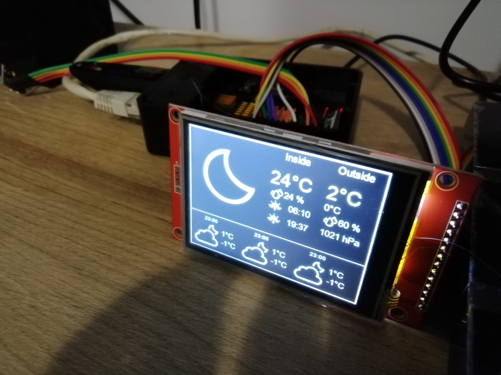

# DIY Weather Station 

This project shows how to build own weather station using raspberry pi, SPI display and SHT30 module.

# Hardware

It was developed on RaspberryPi 4B.

Other hardware:
* SHT30 - conneted via I2C
* ILI9341 display - connected via SPI

# Software 

Project was developed in Python using Adafruit library. Outside weather is obtained from openWeatherMap API. If you would like to run it, you need provide the API key from openWeatherMap.

# Photo

